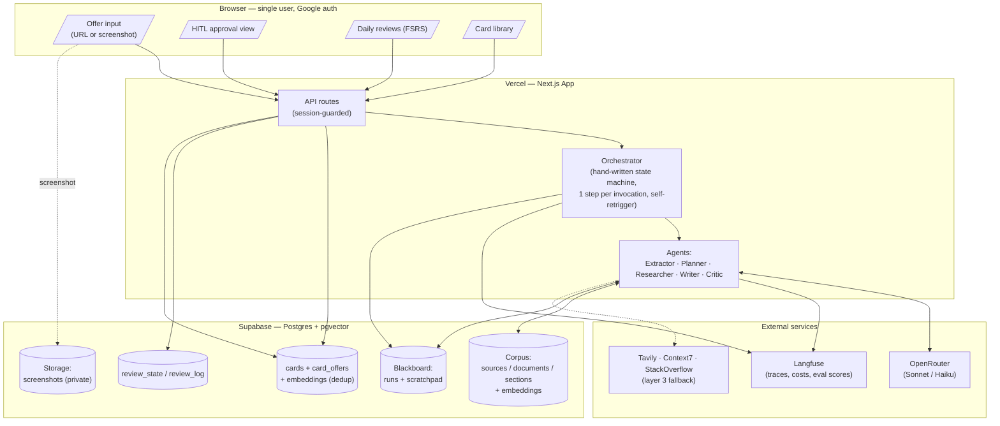
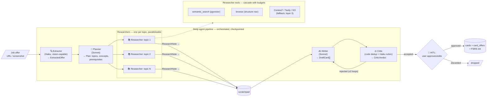
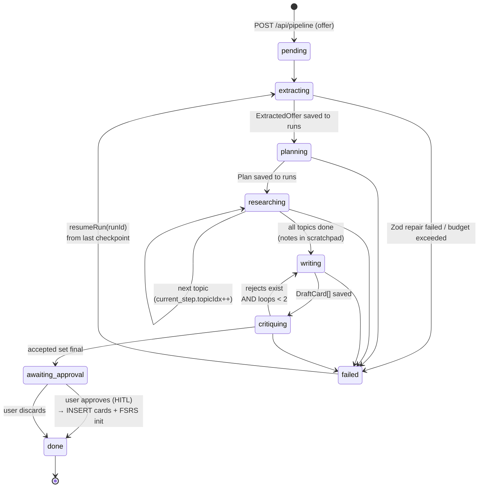
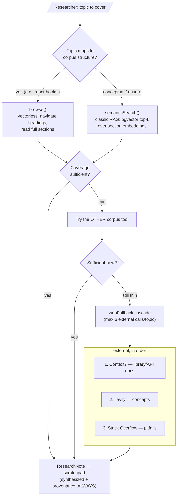
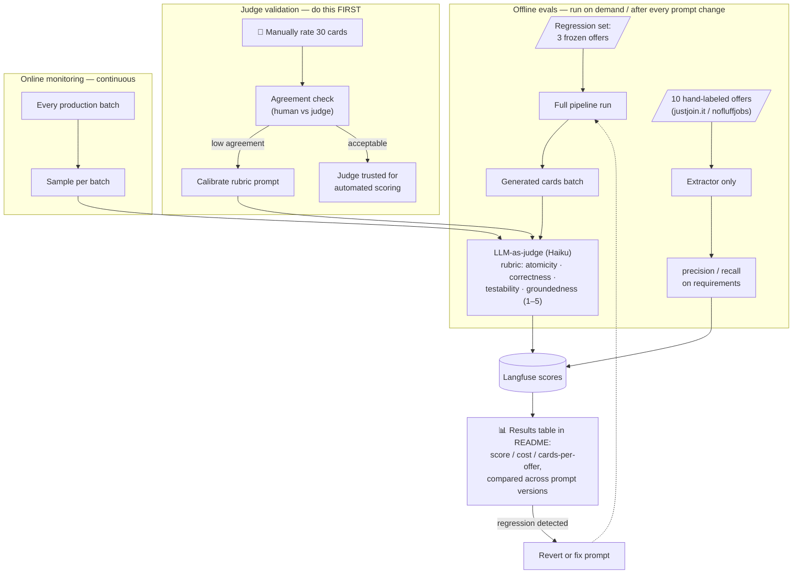

# DeepPrep — CLAUDE.md

> **DeepPrep** — a deep-agent pipeline that turns job offers into source-grounded,
> spaced-repetition flashcards. Private, single-user. Input: a job offer (URL or
> screenshot). Output: high-quality flashcards scheduled with FSRS.
> Built by one developer (Paweł) with Claude Code. Not a commercial product.

---

## 1. Purpose & Core Loop

1. User submits a job offer (URL or screenshot).
2. A multi-agent pipeline extracts requirements, plans topics, researches sources, writes flashcards, and critiques them.
3. User reviews/approves drafts (HITL) → cards saved to the global card pool.
4. User does daily reviews via FSRS spaced repetition.

**Key principles:**
- Cards are **global**, not per-offer. Offers only *link* to cards (`card_offers`).
- Every card must have **provenance** (source reference). No source → Critic rejects.
- No gap analysis / self-assessment. FSRS naturally retires known material.
- Deduplication via embeddings: a new offer never regenerates existing cards, it links them.
- Context discipline: each agent receives only its slice of data, never the full history.

---

## 1a. System Architecture (diagram)



Reading guide: the browser never touches the DB directly — everything goes through
session-guarded API routes. The orchestrator advances one pipeline step per serverless
invocation, persisting state to the blackboard (`runs` + `scratchpad`) so any run can
resume after a crash or redeploy.

---

## 2. Tech Stack

| Concern | Choice | Notes |
|---|---|---|
| Framework | Next.js 15 (App Router, TypeScript, strict) | deployed on Vercel |
| AI layer | Vercel AI SDK + `@openrouter/ai-sdk-provider` | `generateObject` + Zod everywhere |
| Models | OpenRouter | per-agent model map in `src/lib/models.ts` |
| DB | Supabase (Postgres + pgvector) | also stores agent state (runs, scratchpad) |
| Spaced repetition | `ts-fsrs` | do NOT implement FSRS manually |
| Observability | Langfuse (cloud free tier) | tracing from day 1, every LLM call |
| Auth | Auth.js (NextAuth v5) + Google provider | single-user allowlist, see §8 |
| Web research | Tavily API, Context7 MCP, Stack Overflow via search | layer 3 |
| Styling | Tailwind + shadcn/ui | keep UI simple, function over form |

**Orchestration is hand-written TypeScript.** No LangGraph/LangChain. Rationale: the
pipeline is linear with one revision loop; custom orchestration (state machine +
Postgres checkpointing) is simpler, fully debuggable, and a deliberate learning goal.
Document this decision in README ("Why not LangGraph").

---

## 3. Repository Structure

```
src/
  app/                      # Next.js routes
    (auth)/login/
    reviews/                # daily FSRS queue (home screen)
    library/                # all cards: filter, search, edit
    offers/                 # offer list + per-offer view
    offers/[id]/run/        # pipeline progress + HITL approval
    api/
      pipeline/             # start/resume runs
      cron/                 # (future) scheduled jobs
  agents/
    extractor.ts
    planner.ts
    researcher.ts
    writer.ts
    critic.ts
    contracts.ts            # ALL Zod schemas (inter-agent contracts)
  orchestrator/
    run.ts                  # state machine: step sequencing, resume, retries
    state.ts                # load/save run state to Postgres
  retrieval/
    semanticSearch.ts       # pgvector top-k over corpus sections
    browse.ts               # structural navigation (layer 4)
    webFallback.ts          # Tavily / Context7 / SO cascade (layer 3)
  lib/
    models.ts               # role → OpenRouter model string
    langfuse.ts
    fsrs.ts                 # thin wrapper over ts-fsrs
    db.ts                   # Supabase client (server-side, service role)
scripts/
  ingest.ts                 # corpus ingestion CLI
  eval/                     # eval harness (layer 5)
supabase/
  migrations/
CLAUDE.md
README.md
```

---

## 4. Database Schema (Supabase migrations)

```sql
-- ===== Corpus (hybrid retrieval) =====
create table sources (
  id uuid primary key default gen_random_uuid(),
  name text not null,                  -- "tech-interview-handbook"
  kind text not null,                  -- 'github_repo' | 'book' | 'own_notes'
  url text,
  license text not null,              -- 'mit' | 'cc-by-sa' | 'proprietary-personal' | 'own'
  created_at timestamptz default now()
);

create table documents (
  id uuid primary key default gen_random_uuid(),
  source_id uuid references sources(id) on delete cascade,
  path text not null,                  -- "react.md"
  title text,
  ord int                              -- order within source
);

create table sections (
  id uuid primary key default gen_random_uuid(),
  document_id uuid references documents(id) on delete cascade,
  heading_path text[] not null,        -- ['React', 'Hooks', 'useEffect']
  content text not null,               -- full section text (200–800 tokens target)
  ord int,
  embedding vector(1536)               -- per SECTION, not small chunks
);
create index on sections using ivfflat (embedding vector_cosine_ops);

-- ===== Offers & Cards (global pool, N:M) =====
create table offers (
  id uuid primary key default gen_random_uuid(),
  input_kind text not null,            -- 'url' | 'screenshot'
  raw_input text,                      -- URL or storage path to image
  company text, role text, seniority text,
  extracted jsonb,                     -- ExtractedOffer (Zod-validated)
  created_at timestamptz default now()
);

create table topics (
  id uuid primary key default gen_random_uuid(),
  slug text unique not null,           -- 'react-hooks', 'rag-evals'
  name text not null
);

create table cards (
  id uuid primary key default gen_random_uuid(),
  topic_id uuid references topics(id),
  kind text not null,                  -- 'concept' | 'interview_question' | 'coding_task'
  front text not null,
  back text not null,
  provenance jsonb not null,           -- [{sourceRef | url, quoteOrSection}]
  embedding vector(1536),              -- for dedup + semantic library search
  status text not null default 'active',  -- 'active' | 'suspended'
  created_at timestamptz default now()
);
create index on cards using ivfflat (embedding vector_cosine_ops);

create table card_offers (
  card_id uuid references cards(id) on delete cascade,
  offer_id uuid references offers(id) on delete cascade,
  primary key (card_id, offer_id)
);

-- ===== FSRS reviews (global per card) =====
create table review_state (
  card_id uuid primary key references cards(id) on delete cascade,
  due timestamptz not null,
  stability real, difficulty real,
  reps int default 0, lapses int default 0,
  state int not null default 0,        -- ts-fsrs State enum
  last_review timestamptz
);

create table review_log (
  id bigserial primary key,
  card_id uuid references cards(id) on delete cascade,
  rating int not null,                 -- 1..4 (Again/Hard/Good/Easy)
  reviewed_at timestamptz default now(),
  elapsed_days real, scheduled_days real
);

-- ===== Agent runtime: blackboard pattern =====
create table runs (
  id uuid primary key default gen_random_uuid(),
  offer_id uuid references offers(id),
  status text not null default 'pending',
    -- 'pending'|'extracting'|'planning'|'researching'|'writing'|'critiquing'
    -- |'awaiting_approval'|'done'|'failed'
  current_step jsonb,                  -- e.g. {"phase":"researching","topicIdx":3}
  plan jsonb,                          -- Plan (Zod)
  draft_cards jsonb,                   -- DraftCard[] awaiting HITL
  error text,
  cost_usd numeric default 0,          -- accumulated, enforced against budget
  created_at timestamptz default now(),
  updated_at timestamptz default now()
);

create table scratchpad (
  id bigserial primary key,
  run_id uuid references runs(id) on delete cascade,
  topic_slug text not null,
  content text not null,               -- researcher notes (synthesized, not raw dumps)
  provenance jsonb not null,
  created_at timestamptz default now()
);
```

**RLS:** enable on all tables; since single-user, a simple policy checking the
authenticated user's email against `ALLOWED_EMAIL` (or just use service-role key
server-side only and no client-side DB access — preferred, simpler).

---

## 5. Agents & Contracts

### 5.0 Deep agent pipeline (diagram)



### 5.0a What makes this a *deep* agent (not a prompt chain)

The pipeline has all the structural properties of a deep-agent system, each mapped
to a concrete mechanism in this codebase:

| Deep-agent property | Implementation here |
|---|---|
| **Planning / task decomposition** | Planner turns raw requirements into a topic tree with atomic concepts and prerequisites — downstream work is driven by this plan, not by the original prompt |
| **Sub-agent delegation** | One Researcher instance per topic; each runs its own tool loop (retrieval cascade) in isolation; parallelizable via `Promise.all` |
| **Shared working memory (blackboard)** | `scratchpad` table — Researchers write synthesized notes + provenance; Writer reads selected notes. Nobody ships raw dumps through the LLM context |
| **Context isolation** | Each agent sees ONLY its Zod-typed input slice (Researcher #7 never sees notes #1–6; Writer never sees the raw offer) — context stays small and costs bounded |
| **Reflection / self-correction loop** | Critic reviews drafts against a rubric and sends rejects back to Writer, max 2 iterations — quality gate, not a single-shot generation |
| **Long-horizon durability** | Every phase checkpointed to `runs` (status + `current_step` + outputs); runs survive crashes/redeploys and resume mid-topic |
| **Human-in-the-loop** | Pipeline pauses at `awaiting_approval`; nothing enters the card pool without explicit user approval |
| **Bounded autonomy (guardrails)** | Per-run cost budget ($1.50 hard stop), per-topic external-call budget (6), revision-loop cap (2), provenance requirement enforced by Critic |

The orchestrator (§6) is the "brain stem": it owns sequencing, persistence, and
budgets, while agents own reasoning. Agents never call each other directly — all
hand-offs go through the orchestrator and the blackboard.

All inter-agent data is Zod-validated. Schemas live in `src/agents/contracts.ts`.

```ts
// contracts.ts (essentials)
export const ExtractedOffer = z.object({
  company: z.string(), role: z.string(),
  seniority: z.enum(['junior','mid','senior','staff','unknown']),
  mustHave: z.array(z.string()),
  niceToHave: z.array(z.string()),
  domain: z.string().optional(),
});

export const Plan = z.object({
  topics: z.array(z.object({
    slug: z.string(), name: z.string(),
    concepts: z.array(z.string()),        // atomic concepts to cover
    prerequisites: z.array(z.string()),
    estimatedCards: z.number().int().min(1).max(15),
  })),
});

export const ResearchNote = z.object({
  topicSlug: z.string(),
  content: z.string(),                    // synthesized material
  provenance: z.array(z.object({
    kind: z.enum(['corpus','context7','web','stackoverflow']),
    ref: z.string(),                      // sectionId or URL
  })).min(1),
});

export const DraftCard = z.object({
  topicSlug: z.string(),
  kind: z.enum(['concept','interview_question','coding_task']),
  front: z.string(), back: z.string(),
  provenance: z.array(z.object({ kind: z.string(), ref: z.string() })).min(1),
});

export const CriticVerdict = z.object({
  accepted: z.array(z.number()),          // indices of accepted drafts
  rejected: z.array(z.object({
    index: z.number(),
    reason: z.enum(['duplicate','not_atomic','no_source','answer_leaks','incorrect']),
    note: z.string(),
  })),
});
```

### Agent roles & model map (`src/lib/models.ts`)

| Agent | Model (OpenRouter) | Job |
|---|---|---|
| Extractor | `anthropic/claude-haiku-4.5` | offer → `ExtractedOffer`; vision variant for screenshots |
| Planner | `anthropic/claude-sonnet-4.6` | requirements → `Plan` (topics, concepts, prerequisites) |
| Researcher | `anthropic/claude-sonnet-4.6` | per topic: retrieval cascade → `ResearchNote` (synthesis quality is critical — see note) |
| Writer | `anthropic/claude-sonnet-4.6` | plan + notes → `DraftCard[]` |
| Critic | `anthropic/claude-haiku-4.5` | rubric check + embedding dedup → `CriticVerdict` |

Keep model strings ONLY in `models.ts`. Never hardcode in agents.

**Model policy:** start quality-first (Sonnet wherever reasoning/synthesis matters),
then downgrade selectively AFTER layer-5 evals exist. Planned experiment #1:
Researcher on Haiku vs Sonnet over the regression set — publish the quality/cost
table in README. Never downgrade a model without a regression run proving parity.
Haiku is kept only where the task is mechanical (schema extraction) or narrow
classification (rubric check), and where the hard part is done in code (dedup).

### Writer rules (system prompt requirements)
- One card = one atomic fact/concept. Split if in doubt.
- The front must not leak the answer.
- The back must be derivable from the research notes (groundedness).
- Every card carries provenance copied from the notes it used.
- `interview_question` cards: front = realistic interview phrasing; back = strong concise answer.

### Critic pipeline (deterministic + LLM)
1. **Dedup (code, not LLM):** embed each draft front+back; cosine similarity vs
   `cards.embedding`; if > 0.90 → reject as `duplicate`, instead INSERT into
   `card_offers` linking the existing card to this offer.
2. **Rubric (LLM):** atomicity, source-groundedness, answer-leak, correctness.
3. Rejected (non-duplicate) drafts go back to Writer. **Max 2 revision loops**, then
   surface remaining rejects to the user in HITL view.

---

## 6. Orchestrator (`src/orchestrator/run.ts`)

### 6.0 Run state machine (diagram)



Every arrow = one serverless invocation that (1) loads state from `runs`,
(2) executes exactly one step, (3) persists results, (4) re-triggers itself.
`failed` is always resumable from the last completed checkpoint — never from zero.

Hand-written state machine. Requirements:

- Each phase transition persists to `runs` (status + `current_step` + phase output).
  A crashed/redeployed run resumes from the last completed step (`resumeRun(runId)`).
- Researcher loop: sequential in layer 1 (`for topic of plan.topics`);
  parallelize with `Promise.all` later (each writes its own scratchpad rows).
- Each agent call wrapped in: Langfuse trace/span → Zod parse → on parse failure,
  one repair attempt (feed validation errors back) → then fail the run with a clear error.
- **Budget guard:** accumulate cost per run (Langfuse usage or token counts × price
  table). Hard stop at `RUN_BUDGET_USD` (default **$1.50/run**) → status `failed`,
  error `budget_exceeded`. Also set a monthly key limit ($10) in OpenRouter dashboard.
- Long-running work must NOT live inside a single serverless request. Pattern:
  API route advances **one step** per invocation and re-triggers itself
  (fetch to self / Vercel background function), reading state from `runs`.
  This keeps every invocation under serverless time limits and makes resume trivial.

---

## 7. Retrieval — Hybrid: classic RAG + vectorless RAG

### 7.0 Design decision & rationale

We deliberately combine two retrieval philosophies instead of picking one:

| | Classic RAG (`semanticSearch`) | Vectorless RAG (`browse`) |
|---|---|---|
| Mechanism | pgvector cosine similarity over section embeddings | agent navigates document STRUCTURE: list sources → list docs → read sections |
| Strength | finds content scattered ACROSS sources (e.g. "hooks" appears in 3 repos + own notes) | reads COMPLETE sections in context; zero chunking artifacts; provenance is free |
| Weakness | chunk boundaries can cut lists/code mid-thought | blind to content hidden in unexpectedly-named files; more tokens per query |
| Cost | 1 embedding + 1 SQL query | multiple LLM tool-loop steps |

**Why hybrid fits THIS corpus:** interview-question repos and course notes are
strongly structured markdown whose hierarchy maps 1:1 to topics ("React hooks" =
literally `react.md#hooks`) — vectorless navigation is natural and lossless there.
But cross-cutting content (a RAG pitfall mentioned inside a "system design" file)
is only findable by embeddings. Two tools, one agent, agent decides.

**Chunking policy that makes both work:** embeddings are computed **per markdown
section** (heading-based, 200–800 tokens; merge tiny, split huge at paragraph
boundaries) — NOT per fixed-size chunk. A section is simultaneously the retrieval
unit for RAG, the reading unit for browse, and the provenance unit. One table
(`sections`), three roles.

### 7.1 Researcher decision heuristic (in its system prompt)

```
1. Topic maps cleanly to a known source's structure
   (framework/technology name matches a document)?  → START with browse.
2. Topic is conceptual, cross-cutting, or you're unsure where it lives?
                                                     → START with semanticSearch.
3. After first pass: if coverage feels thin, use the OTHER tool before
   going external. Corpus (both tools) ALWAYS before web fallback.
4. Still insufficient → webFallback cascade (layer 3), respecting budgets.
```

### 7.2 Retrieval cascade (diagram)



### 7.3 Tool specs

**`semanticSearch(query, k=8)`** *(layer 1)*: pgvector cosine over
`sections.embedding`, returns sections with `heading_path` + source name
(provenance-ready).

**`browse(sourceName, path?)`** *(layer 4; schema-ready from day 1)*: structural
navigation — list documents of a source, list sections of a document, read a full
section by id. Backed by the same `sources/documents/sections` tables; no
embeddings involved.

**`webFallback(topic)`** *(layer 3)*: ordered cascade, each with a step budget:
1. Context7 (library/framework/API topics);
2. Tavily web search (concepts);
3. Stack Overflow via search (practical pitfalls).
Every external result stored in scratchpad with URL provenance. Max 6 external
calls per topic. Corpus is always exhausted first.

**Embeddings:** OpenAI `text-embedding-3-small` (1536 dims) via OpenRouter or direct;
one embedding call per section at ingest, per card at save.

**Build order note:** layer 1 ships with `semanticSearch` only (simpler single-agent
flow); `browse` activates in layer 4 with the multi-agent split — but the schema
supports it from the first migration, so no rework.

---

## 8. Auth — Google, single account only

Auth.js (NextAuth v5), Google provider, **email allowlist of exactly one**:

```ts
// auth.ts
callbacks: {
  signIn({ profile }) {
    return profile?.email === process.env.ALLOWED_EMAIL
        && profile?.email_verified === true;
  },
}
```

- Every route (pages + API) behind middleware requiring a session; `/login` public.
- Anyone else who authenticates with Google gets rejected at `signIn` → generic
  "access denied" page. No user table needed.
- Google Cloud Console: OAuth consent screen can stay in **Testing** mode with your
  account as the only test user — second line of defense, zero verification hassle.
- Cron/pipeline API routes triggered internally: protect with `CRON_SECRET` header
  check instead of session.

---

## 9. Deployment

**Vercel (app):**
- Connect GitHub repo → auto-deploy on push to `main`. Preview deploys for PRs.
- Env vars (Production + Preview):
  ```
  OPENROUTER_API_KEY=
  OPENAI_API_KEY=            # embeddings only (or route via OpenRouter)
  SUPABASE_URL=
  SUPABASE_SERVICE_ROLE_KEY= # server-only, never NEXT_PUBLIC
  AUTH_SECRET=               # npx auth secret
  AUTH_GOOGLE_ID=
  AUTH_GOOGLE_SECRET=
  ALLOWED_EMAIL=
  LANGFUSE_PUBLIC_KEY=
  LANGFUSE_SECRET_KEY=
  LANGFUSE_HOST=https://cloud.langfuse.com
  TAVILY_API_KEY=            # layer 3
  CRON_SECRET=
  RUN_BUDGET_USD=1.5
  ```
- Screenshots: upload to Supabase Storage (private bucket), pass signed URL to the
  vision Extractor.

**Supabase:**
- Enable `vector` extension. Migrations via `supabase db push` (keep SQL in repo).
- No client-side Supabase access; all DB via server routes with service role key.

**Ingest (`scripts/ingest.ts`)** — run locally, writes to remote Supabase:
```
pnpm ingest --source github:DopplerHQ/awesome-interview-questions
pnpm ingest --source github:yangshun/tech-interview-handbook
pnpm ingest --source github:alirezadir/Machine-Learning-Interviews
pnpm ingest --dir ./my-notes --name "ai-devs-4" --license proprietary-personal
```
Steps: clone/read → parse markdown into heading-based sections (merge tiny ones,
split >800-token ones at paragraph boundaries) → embed → upsert. Idempotent
(re-ingest updates by `source+path+heading_path`).

---

## 10. Build Layers (order of work)

**Layer 1 — MVP (usable end-to-end):**
ingest script + corpus in DB → offer by URL → Extractor → *single agent* does
plan+research(corpus only)+write in one orchestrated flow → HITL approve →
cards + FSRS → `/reviews` queue + `/library` list. Langfuse wired.

**Layer 2:** screenshot input (vision Extractor) + embedding dedup in Critic +
library semantic search + per-offer view with readiness (% of linked cards in
FSRS state ≥ Review).

**Layer 3:** web fallback cascade (Tavily/Context7/SO) + provenance for external
sources + per-topic budgets.

**Layer 4:** split into true multi-agent (Planner / parallel Researchers / Writer /
Critic revision loop) + scratchpad + resumable runs (already schema-ready).

**Layer 5 — Evals (`scripts/eval/`):**



Rules of the eval system:
- **Judge is validated before it is trusted** (§validation) — never ship judge scores
  without the 30-card human-agreement check.
- **Any prompt or model change** requires a regression-set run; results are compared
  against the previous version in the README table (score, cost, card count).
- Eval scores are written to Langfuse as `scores` attached to traces — one place to
  see quality + cost + latency together.

Details:
- Card rubric (LLM-as-judge, Haiku): atomicity / correctness / testability /
  groundedness, 1–5 each; run on a sample of every generation batch → Langfuse scores.
- **Judge validation:** manually rate 30 cards, compute agreement with the judge;
  calibrate rubric until acceptable.
- Extractor eval: 10 real offers (justjoin.it / nofluffjobs) with hand-labeled
  ground truth → precision/recall on requirements.
- **Regression set:** 3 frozen offers; run the full pipeline after any prompt/model
  change; compare rubric scores + cost + card counts. Keep results table in README.

**Rule: after Layer 1 the app must be genuinely usable daily. Everything after is
additive. If life interrupts at any layer boundary, the project still stands.**

---

## 11. Conventions for Claude Code

- TypeScript strict; no `any` in agent/orchestrator code.
- All LLM calls: `generateObject` with a schema from `contracts.ts` (exception:
  none in this project — no free-text LLM outputs).
- Every LLM call inside a Langfuse span with `agent`, `model`, `runId`, `topicSlug`.
- Prompts live in `src/agents/prompts/*.ts` as exported template functions —
  never inline in logic files (evals depend on prompt versioning).
- Migrations only via files in `supabase/migrations`; never mutate schema ad hoc.
- Keep UI minimal: shadcn table/card/button, no design work until Layer 5 done.
- Commit style: `layer1: ingest script`, `layer1: extractor + contract`, etc.
- When in doubt about scope: smaller. Layer 1 completeness beats layer 3 fragments.
