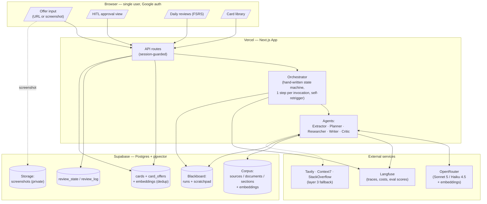
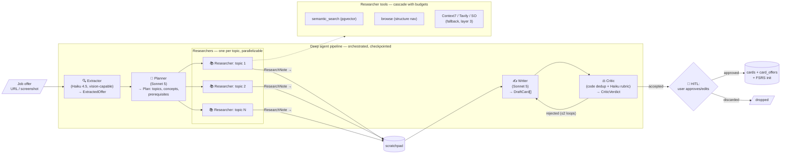
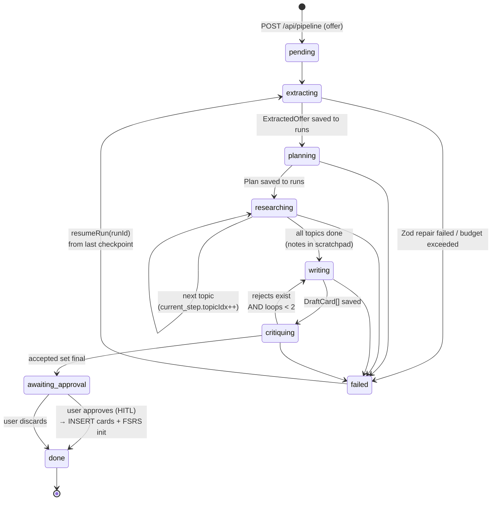
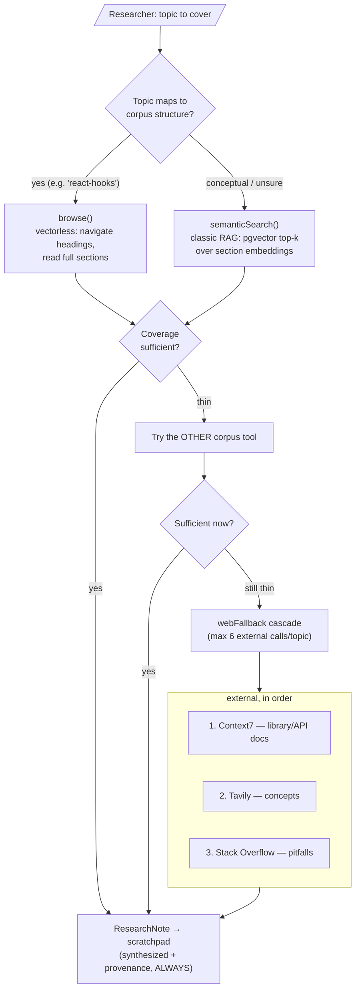
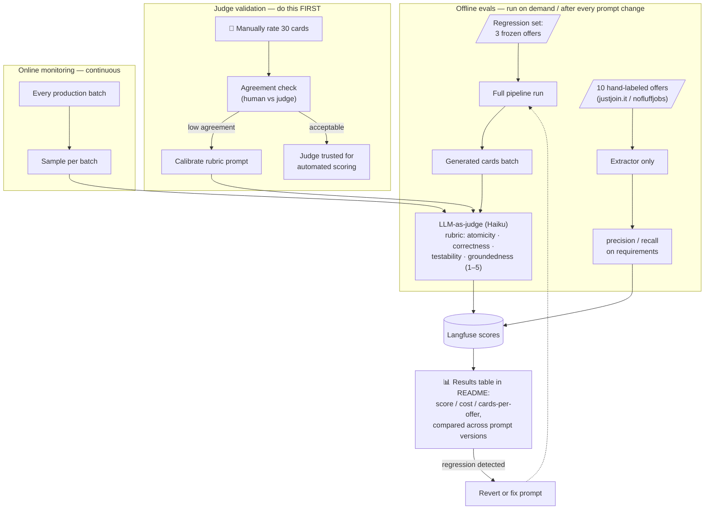

# DeepPrep

**A deep-agent pipeline that turns job offers into source-grounded, spaced-repetition flashcards.**

Paste a job offer URL. A multi-agent pipeline extracts the requirements, plans study
topics, researches them against a private corpus, and drafts flashcards. You approve or
edit them. Approved cards enter a global pool scheduled with [FSRS](https://github.com/open-spaced-repetition/ts-fsrs).

Private, single-user, built as a learning project — not a commercial product. The
interesting parts are the ones you can't see from a screenshot: durable orchestration,
context isolation between agents, provenance enforced in code rather than trusted from
a model, and a retrieval layer that had to be measured rather than assumed.

---

## Contents

- [What it does](#what-it-does)
- [Architecture](#architecture)
- [What makes this a *deep* agent](#what-makes-this-a-deep-agent)
- [The pipeline](#the-pipeline)
- [Orchestration: why not LangGraph](#orchestration-why-not-langgraph)
- [Retrieval: hybrid RAG + vectorless](#retrieval-hybrid-rag--vectorless)
- [Cross-lingual retrieval (a measured problem)](#cross-lingual-retrieval-a-measured-problem)
- [Guardrails](#guardrails)
- [Evals](#evals-layer-5)
- [Results so far](#results-so-far)
- [Decisions log](#decisions-log-what-this-build-got-wrong)
- [Running it](#running-it)
- [Verification scripts](#verification-scripts)
- [Build layers](#build-layers)

---

## What it does

1. Submit a job offer (URL today; screenshot in Layer 2).
2. **Extractor** reduces it to typed requirements.
3. **Planner** turns requirements into study topics — grouping related ones, dropping
   the unstudiable ("5+ years experience").
4. **Researcher/Writer** retrieves corpus material per topic and writes cards, citing
   the sections it used.
5. **You** approve, edit, or discard each draft. Nothing enters the pool otherwise.
6. Approved cards are scheduled by FSRS and surface in a daily review queue.

Cards are **global**, not per-offer. A second offer requiring PostgreSQL links the
existing cards rather than regenerating them (`card_offers`). Every card carries
**provenance** — no source, no card.

---

## Architecture



The browser never touches the database. Everything goes through session-guarded API
routes; the service-role key stays server-side. The orchestrator advances **one pipeline
step per serverless invocation**, persisting to `runs` so a run survives a crash or
redeploy.

---

## What makes this a *deep* agent

Not a prompt chain. Each property below maps to a concrete mechanism:

| Property | Implementation |
|---|---|
| **Planning / decomposition** | Planner produces a topic tree with atomic concepts and prerequisites. Downstream work is driven by that plan, not by the original prompt. |
| **Sub-agent delegation** | One Researcher pass per topic, each with its own retrieval loop in isolation. Parallelisable via `Promise.all` in Layer 4. |
| **Shared working memory** | `scratchpad` table — synthesized notes plus provenance. Raw retrieval dumps never travel through the LLM context. |
| **Context isolation** | Each agent sees only its Zod-typed slice. The Writer never sees the raw offer; topic *n* never sees notes from topics *1…n-1*. |
| **Reflection loop** | Critic reviews drafts against a rubric and returns rejects to the Writer, capped at 2 iterations (Layer 2). |
| **Long-horizon durability** | Every phase checkpointed to `runs`. `resumeRun()` continues from the last completed step — never from zero. |
| **Human-in-the-loop** | Pipeline halts at `awaiting_approval`. Nothing reaches the card pool without explicit approval. |
| **Bounded autonomy** | $1.50/run hard stop, 6 external calls per topic, 2 revision loops, provenance enforced in code. |

The orchestrator is the brain stem: sequencing, persistence, budgets. Agents own
reasoning. **Agents never call each other** — every hand-off goes through the
orchestrator and the blackboard.

---

## The pipeline



### Run state machine



Every arrow is one serverless invocation that (1) loads state, (2) executes exactly one
step, (3) persists, (4) re-triggers itself. `failed` is always resumable.

**This is tested, not asserted.** `pnpm verify:orchestrator` drives stubbed agents
through a simulated provider outage and checks that the plan and earlier topics' cards
survive, that resume re-enters at the first uncovered topic without duplicating cards,
and that cost only accumulates. It also confirms `advanceRun` *refuses* to restart a
failed run — restarting is an explicit act, never a side effect of polling.

---

## Orchestration: why not LangGraph

The obvious question for an agent project. The answer is that this pipeline is linear
with one revision loop, and the framework would have cost more than it gave:

**What a graph framework provides here** — node/edge modelling, checkpointing,
retry/resume semantics.

**What this project needs** — a status column, a `current_step` JSON blob, and a
`switch` statement. `src/orchestrator/run.ts` is ~250 lines including comments.

**What hand-writing bought:**

- **Debuggability.** A failed run is a row you can `select *` from. The resume point is
  visible in `current_step`. No framework state to decode.
- **Serverless fit.** The constraint isn't graph topology, it's that no invocation may
  outlive its time limit. One-step-per-invocation with self-retrigger falls out of
  writing it directly; expressing it through a framework's execution model would fight it.
- **Testability.** Agent entry points are an injectable `Deps` object, so the entire
  persistence layer is exercised with stubs — no API key, no spend, 20 assertions about
  crash recovery.
- **Learning.** A stated goal. Understanding *why* checkpointing works beats configuring
  something that does it for you.

The honest trade: no free parallelism, no visual graph, no ecosystem tooling. At Layer 4
parallel researchers become `Promise.all` over independent scratchpad writes — which is
about ten lines, because the state model was designed for it from the first migration.

---

## Retrieval: hybrid RAG + vectorless

Two philosophies, deliberately combined:

| | Classic RAG (`semanticSearch`) | Vectorless (`browse`) |
|---|---|---|
| Mechanism | pgvector cosine over section embeddings | agent navigates structure: sources → documents → sections |
| Strength | finds content scattered **across** sources | reads **complete** sections; zero chunking artifacts; provenance is free |
| Weakness | chunk boundaries can cut lists/code mid-thought | blind to content in unexpectedly-named files; more tokens |
| Cost | 1 embedding + 1 SQL query | several LLM tool-loop steps |

**Why hybrid fits this corpus:** interview repos and course notes are strongly
structured markdown whose hierarchy maps 1:1 to topics — "React hooks" is literally
`react.md#hooks`, so structural navigation is natural and lossless. But cross-cutting
content (a RAG pitfall mentioned inside a system-design file) is only findable by
embeddings. Two tools, one agent, the agent decides.



### The chunking policy that makes both work

Embeddings are computed **per markdown section** (heading-based, 200–800 tokens; merge
tiny, split huge at paragraph boundaries) — never per fixed-size chunk. A section is
simultaneously the retrieval unit for RAG, the reading unit for browse, and the
provenance unit. One table, three roles.

The parser earns its tests. It tracks fenced code blocks, so a `# comment` inside a bash
snippet is not mistaken for a heading — a real hazard in repos full of shell examples.
It strips YAML frontmatter and page markup, but **only outside code fences**, so an HTML
question that demonstrates `<head>` keeps its example intact.

---

## Cross-lingual retrieval (a measured problem)

The corpus is bilingual: an English interview handbook plus Polish course notes. After
ingesting the Polish material, topics it covered thoroughly still produced **zero cards**.

Measuring the same questions in both languages showed why:

| Query | EN query | PL query | Δ |
|---|---|---|---|
| RAG chunking and embeddings | 0.395 | **0.611** | +0.216 |
| LLM evaluation / LLM-as-judge | 0.326 | **0.618** | +0.292 |
| vector databases and pgvector | 0.310 | **0.493** | +0.183 |
| agentic workflows / tool calling | 0.436 | **0.638** | +0.201 |

English queries can't reach equally relevant Polish sections — embedding similarity
carries a cross-lingual penalty of roughly 0.2.

**The tempting fix was wrong.** Lowering the similarity floor would have admitted real
noise: an *uncovered* topic ("React hooks", in neither source) scores 0.298, overlapping
the depressed Polish band. The bands had collapsed into each other.

`multilingualSearch` issues each query in every corpus language and keeps each section at
its best score, so sections are judged by a query in their own language:

| | before | after | |
|---|---|---|---|
| LLM evaluation | 0.326 | **0.503** | now clears the floor |
| vector databases | 0.310 | **0.522** | now clears the floor |
| React hooks *(uncovered)* | 0.298 | **0.298** | correctly **not** lifted |

That last row is the point: the fix raises genuine matches without inflating noise.
Result on the same offer: **21 → 56 cards.**

---

## Guardrails

**Provenance is enforced in code, not trusted from the model.** A card may only cite
sections actually retrieved for its topic; anything else is dropped with a logged
reason. A fabricated section id would otherwise produce a citation pointing at unrelated
material — a card that *looks* sourced but isn't is worse than one with no source.

**Budget guard** checks *before* spending, not after — the call that crossed the ceiling
has already been paid for, so checking afterwards lets every run overshoot by one step.
Hard stop at `RUN_BUDGET_USD` (default $1.50) with status `failed` / `budget_exceeded`.

**Groundedness over coverage.** When retrieval returns sections the Writer judges
irrelevant, it writes nothing rather than padding. Runs routinely log
`postgresql: 0 cards from 8 sections`. That costs money to learn nothing — an accepted
trade for not shipping invented cards.

**Schema-validated hand-offs.** Every LLM call goes through one path
(`src/agents/call.ts`): structured output, one repair attempt feeding the validation
error back, then failure with a clear message. Tokens from the failed attempt still
count toward the budget — hiding them would let a run exceed its ceiling unnoticed.

**SSRF guard on offer URLs.** The pipeline fetches whatever URL the user submits, so
`safeFetchText` validates every hop: scheme allowlist, DNS resolution checked against
private/reserved ranges (loopback, RFC1918, link-local incl. cloud metadata
endpoints, CGNAT, IPv6 equivalents), redirects re-validated per hop, and a 2 MiB
response cap streamed rather than trusted from Content-Length.

**Prompt-injection posture.** Offer text is untrusted web content. It travels inside
explicit OFFER markers with a system-prompt contract that it is data, never
instructions; input is capped at 40k chars; and the blast radius is bounded by
construction — extraction output is a Zod schema, cards only cite retrieved section
ids, and nothing a model says can touch the DB outside those shapes.

**Step circuit breaker.** Each run counts its serverless invocations and hard-fails
at 60 (`step_limit_exceeded`). The budget guard stops LLM spend, but only this stops
a state-machine bug that loops *without* spending.

All three are exercised by `pnpm verify:guardrails` — including the metadata-endpoint
block and a breaker trip with agents stubbed to prove they are never reached.

---

## Evals (Layer 5)



Two rules make this an eval system rather than eval theatre:

1. **The judge is validated before it is trusted.** 30 human-rated cards, agreement
   checked, rubric calibrated until acceptable. Judge scores don't ship before that.
2. **Any prompt or model change requires a regression run**, compared against the
   previous version. No model downgrade without a run proving parity.

---

## Results so far

Measured on the same fixture (`scripts/eval/fixtures/senior-ai-engineer.txt`) and the
same corpus, changing one thing at a time:

| Change | Topics | Cards | Cost | Runtime |
|---|---:|---:|---:|---:|
| Baseline (interview corpus only) | 21 | 24 | $0.4896 | 368s |
| Planner grouping prompt | 8 | 21 | $0.2295 | 170s |
| + ai-devs-4 corpus, cross-lingual retrieval | 9 | **56** | $0.6853 | 524s |

The middle row is a pure prompt change: **half the cost and half the runtime for the
same output**, because merged topics share one retrieval pass and unstudiable
requirements ("insurance domain experience") are dropped before they cost anything.

The last row costs more because topics that previously produced nothing now produce
cards — paying for output rather than for empty passes. Still inside the $1.50 ceiling.

Corpus: **2 sources · 95 documents · 744 sections**, embedded for ~$0.007 total.

---

## Decisions log (what this build got wrong)

Kept deliberately — the corrections are more informative than the successes, and each
was found by running something rather than reasoning about it.

**Embeddings: I claimed OpenRouter had none.** I grepped `/api/v1/models` for "embed",
found nothing, and wrote "OpenRouter serves no embedding models" into the spec as a
*verified decision*. It was wrong: OpenRouter serves embeddings at `/api/v1/embeddings`
with a separate catalogue. The evidence was in my own output — I'd noted `POST
/api/v1/embeddings → 401` (exists, needs auth) and read past it. The project needs one
API key, not two.

**FSRS: the spec's schema silently corrupted scheduling.** `review_state` as designed
couldn't round-trip a ts-fsrs `Card` — it lacked `learning_steps`. Nothing would ever
throw; due dates would look plausible while learning-phase cards reset to step 0 on
every review and never graduated. `pnpm verify:fsrs` now demonstrates the field carrying
state (1 → 0 across reviews) so a refactor can't quietly drop it again.

**Zod 4 + Anthropic: a bare `.int()` breaks structured output.** The Planner failed
twice with *"For 'integer' type, properties maximum, minimum are not supported"*. My
first fix — removing an explicit `.min(1).max(15)` — changed nothing, which is what
exposed the real cause: Zod 4 emits safe-integer bounds automatically for **any**
`.int()`. Model-facing schemas now use plain `z.number()` with the bound enforced in code.

**My own prompt sabotaged the translation fix.** The first cross-lingual attempt told
the translator to "keep established English technical terms". It dutifully produced
`"vector databases i pgvector"` (0.329) instead of `"bazy wektorowe i pgvector"` (0.493)
— a sensible-sounding instruction that defeated the feature's entire purpose. Only
visible by comparing against a hand-written translation.

**Corpus noise outranked corpus content.** Retrieval returned YAML frontmatter
(`--- id: dynamic-programming title: ...`) as a top hit. Stripping it exposed a second
layer underneath: Docusaurus `<head>` blocks scoring **higher** than real prose (an
og:image meta tag was the top hit for "negotiating a job offer"). Then my fix broke code
examples by stripping `<head>` inside fences — caught by the test I'd written for
exactly that case.

**`server-only` crashed the CLI.** The guard that keeps the service-role key out of
client bundles throws under plain `tsx`. Typecheck was perfectly happy. Fixed with
`--conditions=react-server` rather than deleting the guard.

**A missing run returned 500.** Supabase `.single()` errors on zero rows, so asking for
a nonexistent run id looked like a server fault. Now `RunNotFoundError` → 404.

---

## Running it

**Requirements:** Node ≥ 20.9, pnpm, a Supabase project, an OpenRouter key.

```bash
pnpm install
cp .env.local.example .env.local     # then fill it in
supabase link --project-ref <ref>
supabase db push                     # schema + pgvector + HNSW + RPCs
```

Ingest a corpus (idempotent; re-running updates in place):

```bash
# --include scopes a monorepo to its actual content. Without it this repo also
# sweeps in its website's scaffolding READMEs — which then surface in retrieval
# and become "grounded" cards about create-t3-app config files. Ask me how I know.
pnpm ingest --source github:yangshun/tech-interview-handbook \
            --include "^apps/website/(contents|blog)/"
pnpm ingest --dir ./my-notes --name "my-notes" --license proprietary-personal \
            --include "^lessons/.*\.md$"
pnpm ingest --source github:org/repo --dry-run   # parse + price, no spend
```

Run the app, or drive one offer from the CLI while iterating on prompts:

```bash
pnpm dev
pnpm pipeline https://justjoin.it/offers/...
pnpm pipeline --text scripts/eval/fixtures/senior-ai-engineer.txt
```

### Environment

| Variable | Purpose |
|---|---|
| `OPENROUTER_API_KEY` | Generation **and** embeddings — one key |
| `SUPABASE_URL`, `SUPABASE_SERVICE_ROLE_KEY` | Server-only; never `NEXT_PUBLIC_` |
| `AUTH_SECRET`, `AUTH_GOOGLE_ID`, `AUTH_GOOGLE_SECRET` | Auth.js v5 |
| `ALLOWED_EMAIL` | The one address permitted to sign in |
| `LANGFUSE_PUBLIC_KEY`, `LANGFUSE_SECRET_KEY` | Tracing (degrades to untraced if absent) |
| `CRON_SECRET` | Authenticates internal step-to-step triggers |
| `RUN_BUDGET_USD` | Hard stop per run (default 1.5) |

---

## Verification scripts

Every non-trivial behaviour has a script that demonstrates it. None require an API key
except `verify:retrieval`.

| Command | Proves |
|---|---|
| `pnpm verify:fsrs` | `Card` round-trips losslessly; `learning_steps` carries state; ratings advance the schedule |
| `pnpm verify:markdown` | Fenced code isn't mistaken for headings; frontmatter and page markup stripped **outside fences only**; merge/split band |
| `pnpm verify:orchestrator` | Crash mid-run preserves state; resume skips completed topics without duplicates; budget guard trips; failed runs don't self-restart |
| `pnpm verify:reviews` | Full review cycle over real HTTP: queue → rate → FSRS reschedule → log → leaves queue |
| `pnpm verify:retrieval` | Retrieval quality against the live corpus, including the uncovered-topic control case |
| `pnpm typecheck` | TypeScript strict, no `any` in agent or orchestrator code |

---

## Build layers

- **Layer 1 — MVP (complete).** Ingest, offer → extract → plan → research → write, HITL
  approval, FSRS reviews, library, auth, Langfuse. Deployed on Vercel.
- **Layer 2 — complete.** Embedding dedup in a `critiquing` phase (≥0.90 cosine →
  existing card linked to the offer instead of a near-copy reaching review), Run again
  with a single-flight guard, per-offer readiness (% of active cards FSRS has promoted
  to Review), semantic library search over card embeddings, screenshot input (private
  bucket → short-lived signed URL → vision extractor), and the guardrail set above.
- **Layer 3.** Web fallback cascade (Tavily / Context7 / Stack Overflow) with per-topic
  budgets and external provenance.
- **Layer 4.** True multi-agent split — Planner / parallel Researchers / Writer / Critic
  revision loop over the scratchpad. Schema-ready since the first migration.
- **Layer 5.** Eval harness: validated LLM-as-judge, frozen regression set, results
  table across prompt versions.

**Rule:** after Layer 1 the app must be genuinely usable daily. Everything after is
additive.

---

## Stack

Next.js 16 (App Router, TS strict) · Vercel AI SDK 7 · OpenRouter (Sonnet 5 / Haiku 4.5)
· Supabase Postgres + pgvector (HNSW) · ts-fsrs · Auth.js v5 · Langfuse · Tailwind +
shadcn/ui.

Design notes and conventions live in [CLAUDE.md](./CLAUDE.md).
